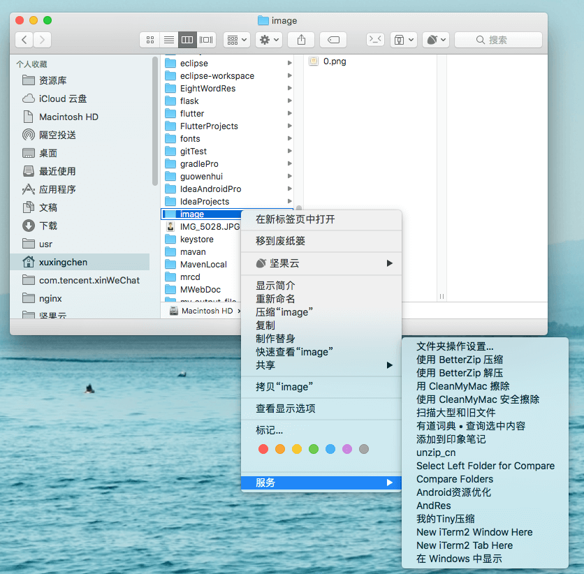

# 简介

1. automator目录下都为Mac系统下自动操作，都以service形式运行
    
    
    

    
   1. 我的Tiny压缩，主要功能为压缩鼠标选中的文件或文件夹中的文件，选中文件夹的话会遍历整个文件夹，需要在环境变量中配置Tiny_Key，以及Tiny_LauncherTiny_Key为在[TinyPng](https://tinypng.com/)网站上申请到的key，Tiny_Launcher为CompEngine.jar文件的绝对路径。
   2. AndRes，主要功能为重命名图片资源的文件名，由于设计师小姐姐给的图片文件名格式可能都是IOS格式的，都包含\@2x，\@3x，如果一张两张还好，要是十张二十张，让电脑帮我们做就是最简单快捷的了，会将\@2x，\@3x字符串替换为空字符串，另外如果选中文件夹的话，会直接生成一个新的文件夹，如果选中的是文件的话，则不会生成新文件，使用时需要在环境变量中配置NameFilter，此为NameFilter.jar文件在本地的绝对路径。
   3. Android资源优化，结合了Tiny压缩与AndRes，在压缩完成后会再进行重命名操作，使用时需要再环境变量中配置Android_Optimize，此为ResOptimize.jar文件的本地绝对路径。
   
   ***以上三个工具在完成对应的任务后都会有系统通知提示***
   
   4. unzip_cn为以gbk编码格式去解压缩zip文件，因为有时候zip文件中带有中文，解压出来就乱码了。。。所以做了这个小工具，使用时需要在环境变量中配置GBK_UNZIP，此为gbk_unzip.py的本地路径。
   
2.  my_alias，此文件是一个自定义命令的文件，主要以自定义别名的形式实现的功能，内部有两个example，以及个人精简后的一些git命令，以后可继续扩充。

